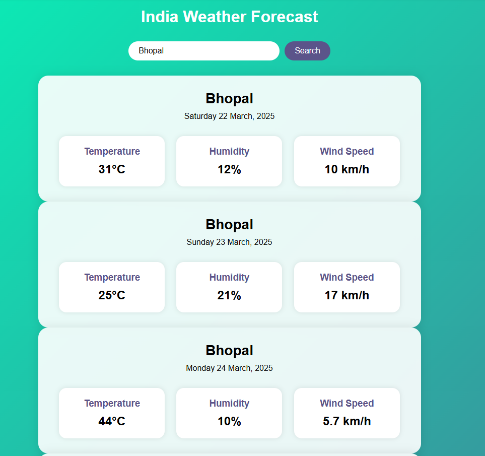

# Basic Whether Prediction App

This is a basic Whether Prediction application that is using API of open whether map and Linear regression algorithm. 


## To Usage and Modify

1. Clone this repository:
    ```bash
    git clone https://github.com/coderpanda11/Whether_Prediction.git
    ```

2. Navigate to the project directory:
    ```bash
    cd Whether_Prediction
    ```

3. Install the required Python packages:
    ```bash
    pip install -r requirements.txt
    ```

4. Update your API KEY

5. Now head over to backend directory and run:
   ```bash
    python app.py
    ``` 

6. And open your live server and visit localhost/templates/index.html

## API change

1. Head over to 
    ```https://openweathermap.org/```

2. Register and Login in the website.

3. In the API section you will get your API KEY.

4. Replace it with "XXXX" in the get_weather() function.

## Example Output



## Fine Tuining
**“Attention all developers and explorers!** 🚀 Ready to fine-tune this application like **Hisenberg** perfecting his formula in *Breaking Bad*? Let’s push boundaries, refine every detail, and craft something exceptional! 💻⚡”
